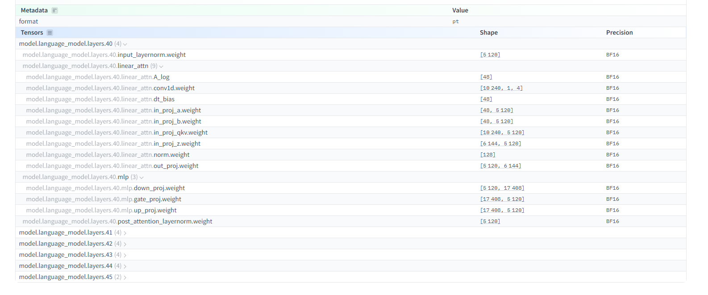

# Huggingface에 대해서 알아보기
## Q. Ollama에서 gemma 모델을 사용하는거랑 hugging face에서 받아다 쓰는거랑 어떤 점이 다를까?
### LLM 엔진/서버 
- Ollama: LLM 실행 엔진 + 로컬 API 서버 역할을 함께 함.
- Hugging Face: 모델 저장소/플랫폼이고, 실제 엔진·서버는 Transformers, TGI, vLLM 같은 별도 도구가 담당함.

|        | Ollama       | Hugging Face              |
| ------ | ------------ | ------------------------- |
| 핵심     | 로컬 LLM 실행/서버 | AI 모델 플랫폼/생태계             |
| 모델     | 여러 오픈 모델 지원  | 매우 많은 모델 제공               |
| 실행     | 매우 간단        | Transformers 등으로 직접 구성 가능 |
| 서버     | 자체 API 서버 제공 | 별도의 서빙 기술 사용 가능           |
| GPU    | 로컬 GPU 사용    | 로컬 GPU 또는 서버 사용           |
| 난이도    | 쉬움           | 상대적으로 높음                  |
| 커스터마이징 | 상대적으로 제한적    | 매우 자유로움                   |


### 실행 과정의 차이

`OpenAI`
```txt
내 프로그램
   ↓
OpenAI API
   ↓
OpenAI 서버
   ↓
LLM
```

`Ollama`
```txt
내 프로그램
   ↓
Ollama
   ↓
내 PC의 GPU
   ↓
LLM
```

```bash
ollama run llama3.1
```

이렇게 실행하면 Ollama가 모델 다운로드부터 실행, GPU/메모리 관리, API 제공까지 상당 부분 처리해줌

ollama run llama3.1을 실행하면 

`Ollama가 모델을 Hub에서 내려받아 저장` → `Ollama 실행 엔진으로 로드` → `GPU/CPU 메모리에 올려 추론` → `로컬 HTTP API 서버로 요청`을 받을 수 있게 처리해줌.

즉 사용자는 복잡한 PyTorch/Transformers 코드 없이 ollama run만 하면 되도록 실행 과정을 추상화해줌.

`Hugging Face`
```txt
Hugging Face Hub
   ↓
모델 다운로드
   ↓
Transformers / PyTorch
   ↓
내 CPU/GPU
   ↓
LLM
```
Hugging Face를 쓰는 가장 큰 이유는 원하는 모델을 자유롭게 선택하고 직접 제어할 수 있기 때문임.

예를 들어 Transformers로 Llama·Qwen·Whisper 같은 모델을 직접 불러와 GPU 사용, 파인튜닝, 양자화, 모델 구조 변경 등을 할 수 있음.


## Q. 허깅 페이스에서 받은 모델 (ex. Whisper) + transformers pipeline 실습에서 cuda 사용가능 환경인지 체크하고 사용했는데, 이게뭘까
```cpp
    if torch.cuda.is_available():
        pipeline.to(torch.device("cuda"))
```
Whisper 같은 큰 모델의 음성 인식 추론을 CPU보다 GPU에서 훨씬 빠르게 실행하려는 목적.

NVIDIA GPU 하드웨어 + 정상적인 NVIDIA 드라이버 + 해당 GPU를 지원하는 PyTorch의 CUDA 빌드가 있는지 확인함.

### CUDA
CUDA는 NVIDIA GPU에서 계산 작업을 할 수 있게 해주는 NVIDIA의 GPU 컴퓨팅 플랫폼임.

원래 CPU가 하던 행렬 계산 같은 작업을 GPU의 수천 개 코어로 병렬 처리할 수 있게 해주고, 

PyTorch가 GPU를 사용하도록 연결해주는 역할도 함.

### pytorch
PyTorch는 Python에서 딥러닝 모델을 만들고 실행하기 위한 오픈소스 머신러닝 프레임워크임.

텐서(데이터), 신경망, 자동 미분, GPU 연산 같은 기능을 제공해서 Whisper나 LLM 같은 AI 모델을 학습·추론할 수 있게 해줌.

### 비유를 하면 
- PyTorch = UE5 → AI 모델을 만들고 실행하는 큰 개발 도구
- CUDA = DirectX/Vulkan + GPU 연동 계층 → GPU를 실제 계산에 활용하게 해주는 기술
- Whisper = UE5로 만든 하나의 게임/콘텐츠 → PyTorch 위에서 실행되는 AI 모델

즉 PyTorch가 CUDA를 이용해서 GPU에서 Whisper를 실행하는것

#### tensor
파라미터는 모델이 학습하면서 얻은 가중치 값들의 개수이고, 그 가중치들을 실제로 담고 있는 데이터 구조가 텐서임.

#### safetensors
AI 모델의 파라미터(가중치)를 저장하는 파일 형식.
```txt
model.safetensors
├── Header
│   ├── tensor_1 → shape: [4096, 4096], dtype: float16
│   ├── tensor_2 → shape: [11008, 4096], dtype: float16
│   └── ...
└── 실제 데이터
    ├── 0.0134
    ├── -0.0271
    ├── 0.0048
    └── ... (수억~수십억 개)
```

 
| 항목                               | 의미                                     |
| -------------------------------- | -------------------------------------- |
| `model.language_model.layers.40` | Transformer의 **40번째 레이어**              |
| `linear_attn`                    | 이 레이어의 **Attention 관련 부분**             |
| `mlp`                            | Attention 이후의 **Feed Forward 네트워크 부분** |
| `Shape`                          | 해당 가중치 텐서의 **크기**                      |
| `Precision BF16`                 | 가중치를 **BFloat16 형식**으로 저장              |

예를 들어 in_proj_qkv.weight [10,240, 5,120]는 5120차원 입력을 받아 Q/K/V 관련 계산을 수행하는 거대한 가중치 텐서이고, out_proj.weight [5120, 6144]는 Attention 결과를 다시 변환하는 가중치임. 즉 화면에 보이는 각각의 항목 하나하나가 모델이 학습해서 얻은 숫자들의 묶음(텐서)라고 생각하면 된다고 함.