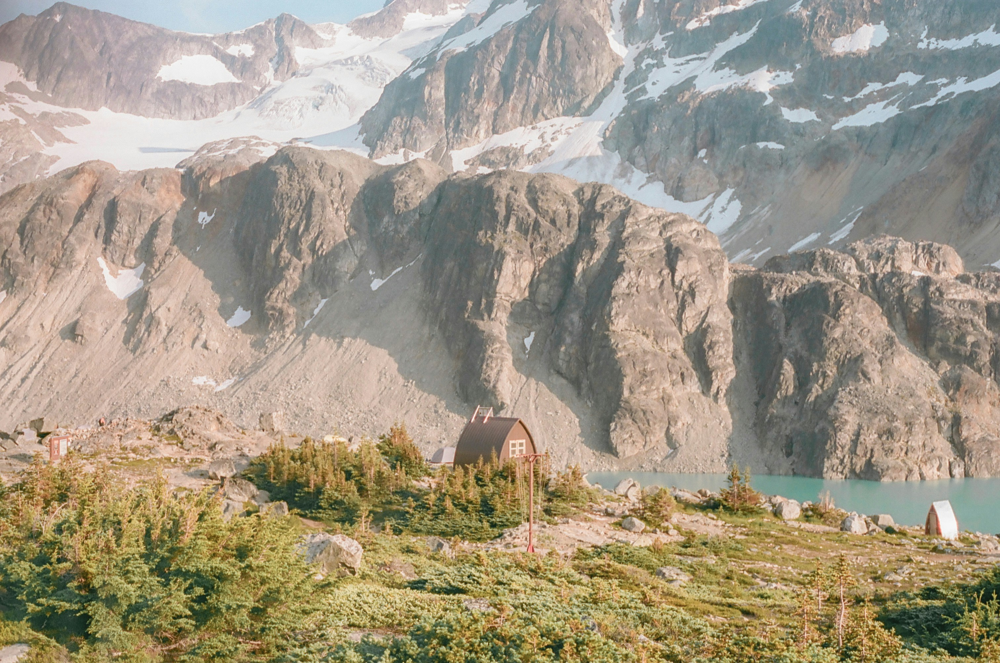
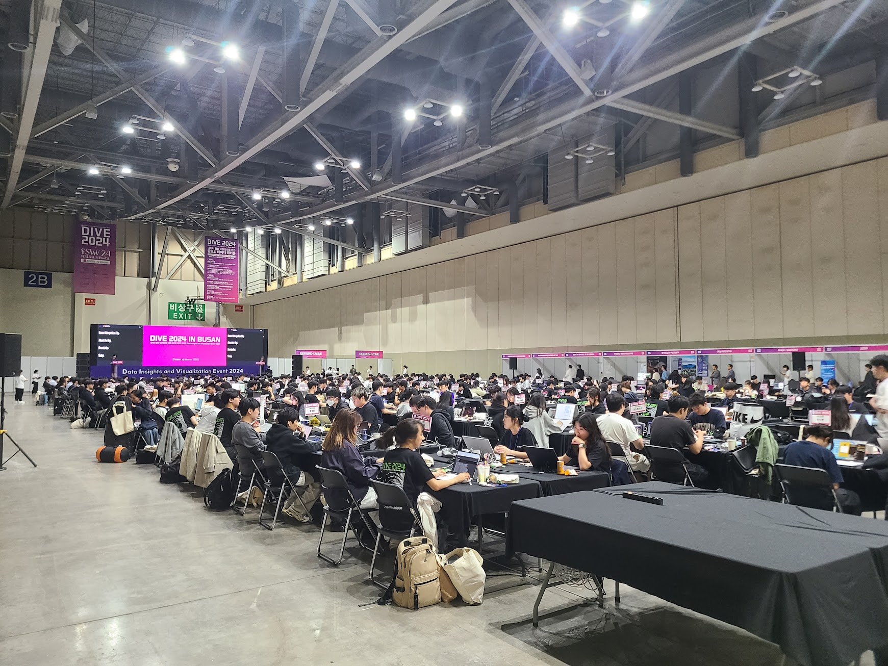
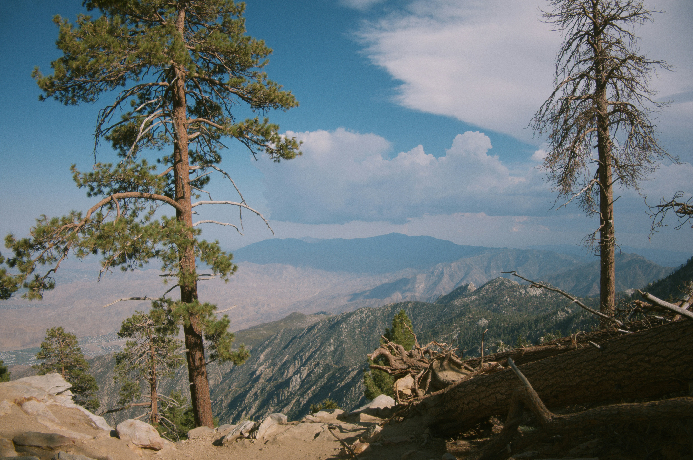

## 문제 1

Q: 다음 이미지에 대한 설명 중 옳지 않은 것은 무엇인가요?  
- (1) 눈과 빙하로 덮인 높은 산들이 보입니다.  
- (2) 호수는 이미지의 왼쪽에 있습니다.  
- (3) 이미지 아래쪽 중앙 부근에 작은 산장이 있습니다.  
- (4) 전경에 나무와 초목이 펼쳐져 있습니다.  

Listening: Which of the following descriptions of the image is incorrect?  
- (1) There are high mountains covered with snow and glaciers.  
- (2) The lake is on the left side of the image.  
- (3) There is a small cabin near the bottom center of the image.  
- (4) Trees and vegetation spread across the foreground.  

정답: **(2)** 호수는 이미지의 왼쪽이 아니라 **오른쪽 아래쪽**에 있습니다.

---------------------

## 문제 2

Q: 다음 이미지에 대한 설명 중 옳지 않은 것은 무엇인가요?

- (1) 많은 사람들이 긴 테이블에 앉아 노트북을 사용하고 있습니다.
- (2) 대형 발표 화면은 행사장 오른쪽에 설치되어 있습니다.
- (3) 테이블 대부분은 검은색 천으로 덮여 있습니다.
- (4) 행사장 곳곳에 “DIVE 2024”라는 문구가 보입니다.

Listening: Which of the following descriptions of the image is incorrect?

- (1) Many people are seated at long tables using laptops.
- (2) A large presentation screen is set up on the right side of the venue.
- (3) Most of the tables are covered with black cloth.
- (4) The words “DIVE 2024” can be seen in several places around the venue.

정답: **(2)** 대형 발표 화면은 오른쪽이 아니라 이미지 왼쪽에 있습니다.

---------------------

## 문제 3

Q: 다음 이미지에 대한 설명 중 옳지 않은 것은 무엇인가요?  
- (1) 사진 앞쪽에 여러 그루의 소나무가 보입니다.  
- (2) 나무들은 모두 잎이 떨어진 앙상한 상태입니다.  
- (3) 나무 뒤쪽으로 산맥이 펼쳐져 있습니다.  
- (4) 하늘은 파란색이며 흰 구름이 일부 보입니다.  

Listening: Which of the following descriptions of the image is incorrect?  
- (1) Several pine trees can be seen in the foreground.  
- (2) All the trees are bare, with no leaves on them.  
- (3) A mountain range stretches out behind the trees.  
- (4) The sky is blue, with some white clouds visible.  

정답: **(2)** 나무들은 잎이 떨어진 앙상한 상태가 아니라, 푸른 솔잎이 많이 달려 있습니다.

---------------------

