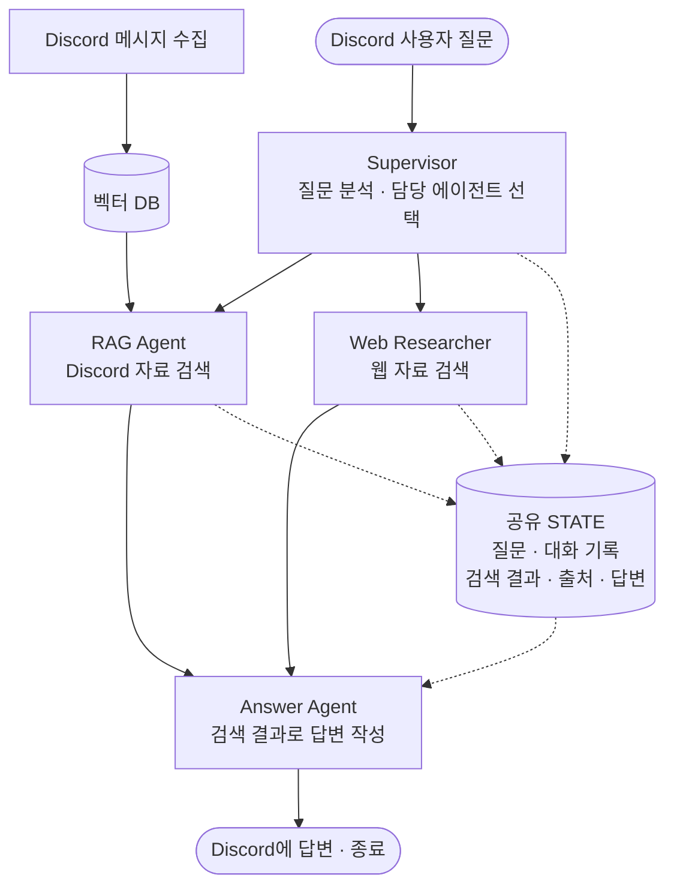

```mermaid
flowchart TD
    START(["Discord 사용자 질문"]) --> supervisor

    supervisor["Supervisor<br/>질문 분석 · 담당 에이전트 선택"]

    supervisor --> rag_agent["RAG Agent<br/>Discord 자료 검색"]
    supervisor --> web_agent["Web Researcher<br/>웹 자료 검색"]

    rag_agent --> answer_agent["Answer Agent<br/>검색 결과로 답변 작성"]
    web_agent --> answer_agent

    answer_agent --> FINISH(["Discord에 답변 · 종료"])

    shared_state[("공유 STATE<br/>질문 · 대화 기록<br/>검색 결과 · 출처 · 답변")]

    supervisor -.-> shared_state
    rag_agent -.-> shared_state
    web_agent -.-> shared_state
    shared_state -.-> answer_agent

    discord["Discord 메시지 수집"] --> db[("벡터 DB")]
    db --> rag_agent
```

- 개인 자료 비서
    - discord에 올라온 내용을 수집.
    - RAG을 통해 내용 검색. 
    - 검색이 필요한 내용이면 web researcher를 실행.